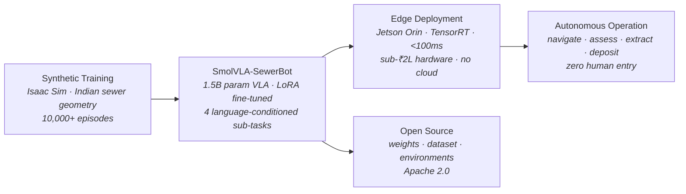

# Sewer-VLA

**Open-source Vision-Language-Action model for autonomous sewer maintenance robotics in India.**

> Manual scavenging kills hundreds of Indian sanitation workers every year. This project provides a freely available AI foundation model that any robotics team can fine-tune for their sewer robot — eliminating the AI development barrier for autonomous alternatives to human entry.

## Architecture



**Edge-first.** Runs on battery-powered field hardware. No cloud dependency.  
**Indian sewer geometry.** Trained on irregular, hand-built tunnels — not European pipe standards.  
**Zero human entry.** Inspection, unblocking, and maintenance without a single worker entering.

## Status

**Phase 0** — MuJoCo proxy environment + toy SmolVLA checkpoint.  
Phase 1 (Isaac Sim on DGX Cloud) in progress.

## Quickstart

```bash
git clone https://github.com/saralsystems/sewer-vla.git
cd sewer-vla
pip install -e ".[dev]"

# Run the environment
python -c "from envs.mujoco import SewerVLAEnv; env = SewerVLAEnv(); obs, _ = env.reset(); print('Ready.')"

# Collect expert demonstrations
python -m data.collect --task all --episodes 100 --output data/raw/

# Export to LeRobot format
python -m data.export_lerobot --input data/raw/ --output data/lerobot/

# Fine-tune SmolVLA (overnight on Mac, minutes on GPU)
python -m training.finetune --dataset data/lerobot/ --output checkpoints/v0/

# Evaluate
python -m evaluation.sewerbench --checkpoint checkpoints/v0/ --episodes 100
```

## Sub-Tasks

The VLA handles four language-conditioned sub-tasks through a single checkpoint:

| Prompt | What it does |
|---|---|
| `"navigate to blockage"` | Base locomotion through pipe to sludge deposit |
| `"assess and position for extraction"` | Arm positioning, scoop alignment to sludge surface |
| `"extract sludge at current position"` | Scoop manipulation, sludge lift |
| `"deposit extracted material"` | Arm to collection bin, release |

## Reference Embodiment

- Tracked differential-drive base, 600mm width (fits Indian municipal mains)
- 4-DOF articulated arm with scoop end-effector (Phase 0; 6-DOF in Phase 1)
- Front RGB-D camera (640×480) + wrist RGB camera (224×224)
- Target hardware: NVIDIA Jetson Orin NX (sub-₹2 lakh)

## Roadmap

- [x] Project structure + specification
- [x] MuJoCo proxy sewer environment
- [x] Scripted expert policies (4 sub-tasks)
- [x] Data collection pipeline → LeRobot format
- [x] SmolVLA LoRA fine-tuning (v0 toy checkpoint)
- [x] SewerBench evaluation harness
- [x] HuggingFace release (dataset + model)
- [ ] Isaac Sim full environment (DGX Cloud)
- [ ] Synthetic data at scale (10K+ episodes)
- [ ] SmolVLA-SewerBot v1 (production checkpoint)
- [ ] TensorRT optimization for Jetson Orin
- [ ] Sim-to-real with IIT / Genrobotics partners

## Contributing

See [CONTRIBUTING.md](docs/CONTRIBUTING.md). We especially welcome:
- MuJoCo environment improvements (better pipe geometry, sludge proxy physics)
- Real-world sewer robot data (any embodiment, any format)
- Isaac Sim USD assets for sewer environments
- Evaluation on real hardware

## Built by

[Saral Systems](https://saralsystems.co) — Contract Research Laboratory, Calcutta, India.  
NVIDIA Inception Member.

## License

Apache 2.0. See [LICENSE](LICENSE).
